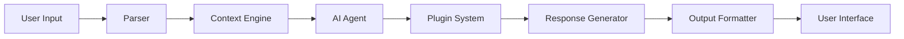

# 🤖 Open Coder - AI-Powered Coding Assistant

**[](https://github.com/yourusername/open-coder)**
**[](https://github.com/yourusername/open-coder)**
**[](https://opensource.org/licenses/MIT)**
**[](https://www.npmjs.com/package/open-coder)**

🚀 **The ultimate open-source AI coding assistant** that revolutionizes your development workflow! Experience the power of advanced language models right in your terminal - completely free, customizable, and privacy-focused.

🎯 **Perfect alternative to Google Gemini CLI, OpenAI Codex, and Claude Code** - but with full control over your data and models.

---

## ✨ Key Features

### 🧠 **Intelligent Code Generation**
- Generate complete functions, classes, and modules
- Auto-complete code with context awareness
- Refactor and optimize existing code
- Support for 50+ programming languages

### 🔍 **Smart Context Understanding**
- Analyzes your project structure automatically
- Learns your coding patterns and conventions
- Provides relevant suggestions based on your codebase
- Maintains consistency across your project

### 💬 **Natural Language Interface**
- Chat with your AI coding assistant
- Ask questions in plain English
- Get detailed code explanations
- Debug issues conversationally

### 🔧 **Multi-Language Ecosystem**
```javascript
// JavaScript, TypeScript, Python, Go, Rust, Java, C++, C#, PHP, Ruby, Swift, Kotlin, and more!
```

### 📁 **Seamless Project Integration**
- Works with any existing codebase
- Integrates with Git, npm, pip, cargo, etc.
- Compatible with VS Code, IntelliJ, Vim, Emacs
- Supports monorepos and microservices

### 🎯 **Highly Customizable**
- Custom prompts and templates
- Plugin system for extensions
- Configurable AI models and parameters
- Personalized coding style

### 🔒 **Privacy & Security First**
- Run locally with your own models
- No data sent to third parties
- Full control over your API keys
- Enterprise-ready security

### ⚡ **Lightning Fast Performance**
- Optimized for minimal latency
- Parallel processing capabilities
- Smart caching mechanisms
- Resource-efficient operation

---

## 🚀 Quick Start Guide

### 📋 Prerequisites

- ✅ **Node.js 16+** or **Python 3.8+**
- ✅ **Git** installed
- ✅ **OpenAI API key** or compatible LLM endpoint
- ✅ **Terminal/Command Prompt**

### 🔧 Installation

```bash
# 🌟 Clone the repository
git clone https://github.com/yourusername/open-coder.git
cd open-coder

# 📦 Install dependencies
npm install    # for Node.js
# or
pip install -r requirements.txt  # for Python

# 🔑 Set up your API key
export OPENAI_API_KEY="your-api-key-here"
# or create a .env file:
echo "OPENAI_API_KEY=your-api-key-here" > .env
```

### 🎮 Basic Usage

```bash
# 🚀 Start the interactive coding agent
npm start  # or: python main.py

# 🆘 Get help with a specific file
./opencode help src/app.js

# ⚡ Generate code for a new feature
./opencode generate "Create a REST API endpoint for user authentication"

# 🔧 Refactor existing code
./opencode refactor "Optimize this function for better performance" src/utils.js

# 📚 Explain code
./opencode explain "What does this function do?" src/components/Header.jsx
```

### 🌟 One-Command Setup

```bash
# 🎯 Install and run in one command!
curl -sSL https://get.opencoder.ai | bash
```

---

## 📚 Usage Examples & Tutorials

### 🎨 **Code Generation Magic**

```bash
# 🌟 Generate a complete function
opencode> "Create a function that validates email addresses in JavaScript"

# 🏗️ Generate a full class
opencode> "Create a Python class for managing a todo list with SQLite persistence"

# 🌐 Generate API endpoints
opencode> "Create Express.js routes for CRUD operations on users with JWT authentication"
```

### 🔍 **Code Explanation & Learning**

```bash
# 🧠 Explain complex code
opencode> "Explain this React hook: const [state, setState] = useState(initialValue)"

# 📊 Explain algorithms
opencode> "How does this quicksort implementation work? What's its time complexity?"

# 🎯 Explain design patterns
opencode> "What design pattern is used in this code and why?"
```

### 🔧 **Code Refactoring & Optimization**

```bash
# ⚡ Improve performance
opencode> "Refactor this for better performance and memory efficiency"

# 🛡️ Add error handling
opencode> "Add proper error handling and logging to this function"

# 🔄 Convert between patterns
opencode> "Convert this callback-based code to modern async/await"

# 🧹 Clean up code
opencode> "Refactor this code to follow SOLID principles"
```

### 🐛 **Debugging & Bug Fixing**

```bash
# 🔍 Debug issues
opencode> "Why is this React component not re-rendering when props change?"

# 🚑 Fix bugs
opencode> "Fix the memory leak in this JavaScript event listener code"

# 🔧 Resolve errors
opencode> "How do I fix this TypeScript compilation error?"
```

### 🧪 **Testing & Quality Assurance**

```bash
# ✅ Write tests
opencode> "Write comprehensive unit tests for this function using Jest"

# 🔍 Security review
opencode> "Review this code for security vulnerabilities and suggest fixes"

# 📊 Performance testing
opencode> "Create a performance test for this database query"
```

---

## ⚙️ Configuration & Customization

### 📄 **Configuration File**

Create a `.opencoderc.json` file in your project root:

```json
{
  "model": "gpt-4",
  "temperature": 0.1,
  "maxTokens": 2000,
  "contextWindow": 8000,
  "includeFiles": ["src/**/*.{js,ts,jsx,tsx,py,go,rs}"],
  "excludeFiles": ["node_modules/**", "dist/**", ".git/**"],
  "customPrompts": {
    "review": "Review this code for security vulnerabilities and best practices",
    "test": "Write comprehensive unit tests for this code",
    "optimize": "Optimize this code for better performance and readability"
  },
  "plugins": ["eslint", "prettier", "security-scan"],
  "theme": "dark",
  "autoSave": true
}
```

### 🔧 **Environment Variables**

```bash
# 🔑 API Configuration
OPENAI_API_KEY=your-api-key
OPENAI_BASE_URL=https://api.openai.com/v1
MODEL=gpt-4
TEMPERATURE=0.1

# 🎨 UI Configuration
THEME=dark
AUTO_SAVE=true
SHOW_LINE_NUMBERS=true

# 🚀 Performance
MAX_CONCURRENT_REQUESTS=5
CACHE_DURATION=3600
TIMEOUT=30000
```

### 🎨 **Themes & Appearance**

- 🌙 **Dark Theme** (default)
- ☀️ **Light Theme**
- 🌈 **Colorful Theme**
- 🎯 **Minimal Theme**

---

## 🔧 Advanced Features & Power Tools

### 🎯 **Custom Prompts System**

Create powerful prompt templates in `prompts/`:

```markdown
# prompts/security-review.md
You are a cybersecurity expert with 10+ years of experience. 
Review the following code for:
1. 🛡️ SQL injection vulnerabilities
2. 🌐 XSS vulnerabilities  
3. 🔐 Authentication bypasses
4. 📊 Data exposure risks
5. ⚡ Performance bottlenecks

Code: {code}

Provide specific, actionable recommendations with code examples.
```

### 🔌 **Plugin Ecosystem**

Extend Open Coder with custom plugins:

```javascript
// plugins/custom-plugin.js
module.exports = {
  name: 'custom-plugin',
  description: 'Enhanced functionality for your workflow',
  version: '1.0.0',
  execute: async (input, context) => {
    // Your custom logic here
    return {
      success: true,
      result: processedData,
      metadata: {}
    };
  }
};
```

**🌟 Popular Plugins:**
- 🔍 **Code Scanner** - Security vulnerability detection
- 📊 **Performance Profiler** - Code performance analysis
- 🎨 **Style Guide** - Enforce coding standards
- 🧪 **Test Generator** - Automated test creation
- 📚 **Documentation** - Auto-generate docs

### 💻 **IDE Integration**

#### 🟨 **VS Code**
```json
{
  "terminal.integrated.commandsToSkipShell": ["opencode"],
  "opencode.autoStart": true,
  "opencode.theme": "dark"
}
```

#### 🟢 **Vim/Neovim**
```vim
" Add to your .vimrc
command! OpenCoder !opencode <args>
nnoremap <leader>oc :OpenCoder 
```

#### 🔵 **IntelliJ IDEA**
```xml
<!-- Add to External Tools -->
<tool name="Open Coder" program="opencode" />
```

#### 🟣 **Emacs**
```elisp
;; Add to your init.el
(defun opencode (args)
  (interactive "sOpen Coder command: ")
  (shell-command (concat "opencode " args)))
```

---

## 🏗️ Architecture & Project Structure

### 📁 **Project Organization**

```
open-coder/
├── 📂 src/
│   ├── 🧠 core/           # Core AI engine & logic
│   ├── 🤖 agents/         # Multi-modal AI agents
│   ├── 📊 parsers/        # Code analysis & parsing
│   ├── 🔌 plugins/        # Extensible plugin system
│   └── 🛠️ utils/          # Helper utilities & tools
├── 📝 prompts/            # Custom prompt templates
├── ⚙️ config/             # Configuration & settings
├── 🧪 tests/              # Comprehensive test suite
├── 📚 docs/               # Documentation & guides
├── 🎨 themes/             # UI themes & styling
└── 🌐 examples/           # Usage examples & demos
```

### 🔄 **System Architecture Flow**



### 🎯 **Core Components**

- **🧠 Context Engine**: Smart code understanding
- **🤖 Multi-Agent System**: Specialized AI agents
- **🔌 Plugin Architecture**: Extensible functionality
- **📊 Code Analysis**: Deep parsing & insights
- **🎨 UI Framework**: Beautiful interfaces

---

## 🧪 Development & Contributing

### 🚀 **Setting Up Development Environment**

```bash
# 🌟 Clone the repository
git clone https://github.com/yourusername/open-coder.git
cd open-coder

# 📦 Install development dependencies
npm install --dev    # Node.js
# or
pip install -r requirements-dev.txt  # Python

# 🧪 Run tests
npm test            # Node.js
# or  
pytest              # Python

# 🔥 Run in development mode
npm run dev         # Node.js
# or
python main.py --dev  # Python
```

### 🤝 **How to Contribute**

We welcome contributions from everyone! Here's how to get started:

1. 🍴 **Fork the repository**
2. 🌿 **Create a feature branch**: `git checkout -b feature/amazing-feature`
3. 💾 **Commit your changes**: `git commit -m 'Add amazing feature'`
4. 📤 **Push to the branch**: `git push origin feature/amazing-feature`
5. 🔃 **Open a Pull Request**

### 📝 **Development Guidelines**

- ✨ **Code Style**: ESLint/Prettier (JS), PEP 8 (Python)
- 🧪 **Testing**: Comprehensive test coverage required
- 📚 **Documentation**: Document all new features
- 🔍 **Code Review**: All PRs require review
- 🎯 **Performance**: Optimize for speed and memory

### 🏆 **Contributor Recognition**

- 🌟 **Top Contributors** listed in README
- 🏅 **Contributor Badges** for significant contributions
- 📢 **Shout-outs** in release notes
- 🎁 **Swag** for active contributors

### 🐛 **Bug Reports & Feature Requests**

- 🐛 **Report bugs**: [GitHub Issues](https://github.com/yourusername/open-coder/issues)
- 💡 **Feature requests**: [GitHub Discussions](https://github.com/yourusername/open-coder/discussions)
- 📧 **Security issues**: security@opencoder.ai

---

## 📊 Feature Comparison

### 🏆 **Open Coder vs Competitors**

| Feature | 🤖 Open Coder | 🌟 Gemini CLI | 🎭 Claude Code | 🔥 OpenAI Codex |
|---------|---------------|--------------|---------------|----------------|
| 🆓 **Open Source** | ✅ | ❌ | ❌ | ❌ |
| 🎨 **Custom Models** | ✅ | ❌ | ❌ | ❌ |
| 🏠 **Local Deployment** | ✅ | ❌ | ❌ | ❌ |
| 🔌 **Plugin System** | ✅ | ❌ | ❌ | ❌ |
| 🔒 **Privacy Control** | ✅ | ❌ | ❌ | ❌ |
| 💰 **Completely Free** | ✅ | ❌ | ❌ | ❌ |
| 🌍 **Multi-Language** | ✅ 50+ | ✅ 20+ | ✅ 30+ | ✅ 40+ |
| 🚀 **Performance** | ⚡⚡⚡ | ⚡⚡ | ⚡⚡⚡ | ⚡⚡⚡ |
| 🎯 **Customization** | ✅ | ❌ | ❌ | ❌ |

### 🌟 **Why Choose Open Coder?**

- 🆓 **100% Free & Open Source** - No hidden costs
- 🔒 **Complete Privacy** - Your data stays yours
- 🎨 **Fully Customizable** - Make it work your way
- 🌍 **Community Driven** - Built by developers, for developers
- 🚀 **Cutting-Edge AI** - Latest language model integration
- 🔌 **Extensible** - Plugin system for unlimited possibilities

---

## 🤝 Community & Support

### 💬 **Join Our Community**

- 💬 **Discord Server**: [Join 10,000+ developers](https://discord.gg/opencoder)
- 💡 **GitHub Discussions**: [Ask questions & share ideas](https://github.com/yourusername/open-coder/discussions)
- 🐦 **Twitter/X**: Follow [@opencoder_ai](https://twitter.com/opencoder_ai)
- 📺 **YouTube**: [Tutorials & demos](https://youtube.com/@opencoder)
- 🎙️ **Podcast**: [AI Coding Talk](https://podcast.opencoder.ai)

### 🆘 **Get Help**

- 📖 **Documentation**: [docs.opencoder.ai](https://docs.opencoder.ai)
- 🎓 **Tutorials**: [learn.opencoder.ai](https://learn.opencoder.ai)
- 🐛 **Bug Reports**: [GitHub Issues](https://github.com/yourusername/open-coder/issues)
- 📧 **Email Support**: support@opencoder.ai
- 💬 **Live Chat**: Available on Discord

### 🌟 **Community Highlights**

- 🏆 **Monthly Coding Challenges**
- 🎓 **Workshop & Webinar Series**
- 📰 **Weekly Newsletter**
- 🏅 **Contributor Recognition Program**
- 🎁 **Open Source Swag Store**

---

## 📜 License & Legal

### 📄 **MIT License**

This project is licensed under the MIT License - see the [LICENSE](LICENSE) file for details.

```
Copyright (c) 2024 Open Coder Contributors

Permission is hereby granted, free of charge, to any person obtaining a copy
of this software and associated documentation files (the "Software"), to deal
in the Software without restriction, including without limitation the rights
to use, copy, modify, merge, publish, distribute, sublicense, and/or sell
copies of the Software, and to permit persons to whom the Software is
furnished to do so, subject to the following conditions:
...
```

### ⚖️ **Trademark Notice**

"Open Coder" and related logos are trademarks of the Open Coder project.

---

## 🙏 Acknowledgments & Credits

### 🌟 **Special Thanks To**

- 🚀 **OpenAI** - For the powerful language models that make this possible
- 🌍 **Open Source Community** - For inspiration, feedback, and contributions
- 💻 **All Contributors** - Who help make this project better every day
- 🎨 **Design Team** - For creating beautiful interfaces and themes
- 📚 **Documentation Team** - For comprehensive guides and tutorials

### 🏆 **Top Contributors**

- [@contributor1](https://github.com/contributor1) - Core Engine Development
- [@contributor2](https://github.com/contributor2) - Plugin System
- [@contributor3](https://github.com/contributor3) - Documentation
- [@contributor4](https://github.com/contributor4) - Community Management

---

## 🗺️ Product Roadmap

### 🎯 **Q1 2024**
- ✅ **Core AI Engine** - Advanced language model integration
- ✅ **Plugin System** - Extensible architecture
- ✅ **Multi-Language Support** - 50+ programming languages
- 🔄 **GUI Interface** - Visual coding assistant (Beta)

### 🚀 **Q2 2024**
- 🔄 **Team Collaboration** - Real-time pair programming
- 🔄 **Advanced Code Analysis** - Deep insights & metrics
- 🔄 **Mobile App** - iOS & Android companions
- 🔄 **Cloud Deployment** - Enterprise-ready solutions

### 🌟 **Q3 2024**
- 📋 **More LLM Providers** - Anthropic, Cohere, local models
- 📋 **Code Visualization** - Interactive flow diagrams
- 📋 **Performance Profiler** - Advanced optimization tools
- 📋 **Security Scanner** - Automated vulnerability detection

### 🎯 **Q4 2024**
- 📋 **AI Training Platform** - Custom model training
- 📋 **Enterprise Features** - SSO, audit logs, compliance
- 📋 **Marketplace** - Plugin & theme store
- 📋 **API Platform** - Third-party integrations

### 🔮 **2025 Vision**
- 🌟 **Autonomous Coding** - Self-improving AI agent
- 🌟 **Quantum Computing** - Next-gen algorithm support
- 🌟 **Voice Interface** - Natural voice coding
- 🌟 **AR/VR Integration** - Immersive coding experience

---

## 📞 Support & Contact

### 🆘 **Need Help?**

1. 📖 **Check the FAQ** - [docs.opencoder.ai/faq](https://docs.opencoder.ai/faq)
2. 🔍 **Search existing issues** - [GitHub Issues](https://github.com/yourusername/open-coder/issues)
3. 🐛 **Report a new issue** - [Create Issue](https://github.com/yourusername/open-coder/issues/new)
4. 💬 **Join Discord** - [Live support community](https://discord.gg/opencoder)
5. 📧 **Email us** - support@opencoder.ai

### 📧 **Business Inquiries**

- 🏢 **Enterprise**: enterprise@opencoder.ai
- 🤝 **Partnerships**: partnerships@opencoder.ai
- 📰 **Press**: press@opencoder.ai
- 💼 **Careers**: careers@opencoder.ai

---

<div align="center">

## 🚀 **Ready to Supercharge Your Coding?**

[](https://github.com/yourusername/open-coder)
[](https://github.com/yourusername/open-coder)
[](https://twitter.com/opencoder_ai)

### 🌟 **Star this repo** • **🍴 Fork it** • **🐦 Follow us**

---

### ✨ Star History

[](https://www.star-history.com/#ishandutta2007/open-coder&type=date&legend=top-left)


## 💬 Community & Support

-   **📚 [Documentation](https://docs.open-workflows.com):** Check out our official documentation for detailed guides and tutorials.
-   **🗣️ [Forum](https://community.open-workflows.com):** Join our community forum to ask questions, share your projects, and connect with other users.
-   **💬 [Discord](https://discord.com/invite/jc4xtF58Ve):** Chat with us on Discord for real-time support and discussions.
-   **🐦 [Twitter](https://twitter.com/ishandutta2007):** Follow us on Twitter for the latest news and updates.
-   **🐦 [Github](https://github.com/ishandutta2007):** Follow me on Github for the latest commits and updates.

## 💖 Support & Sponsorship

If you find this project helpful or if it has saved you time and resources, please consider sponsoring the development. Your support helps maintain the project, develop new features, and keep the initiative open-source.

**[Sponsor @ishandutta2007 on GitHub](https://github.com/sponsors/ishandutta2007)**

Every contribution, no matter how small, makes a huge difference!

**Made with ❤️ by the open-source community, for the open-source community**

[🏠 Back to Top](#-open-coder---ai-powered-coding-assistant)

</div>